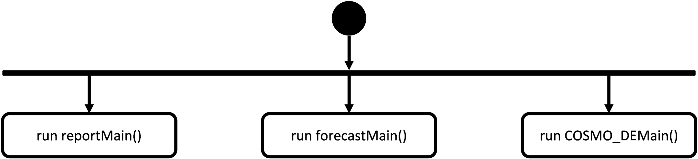
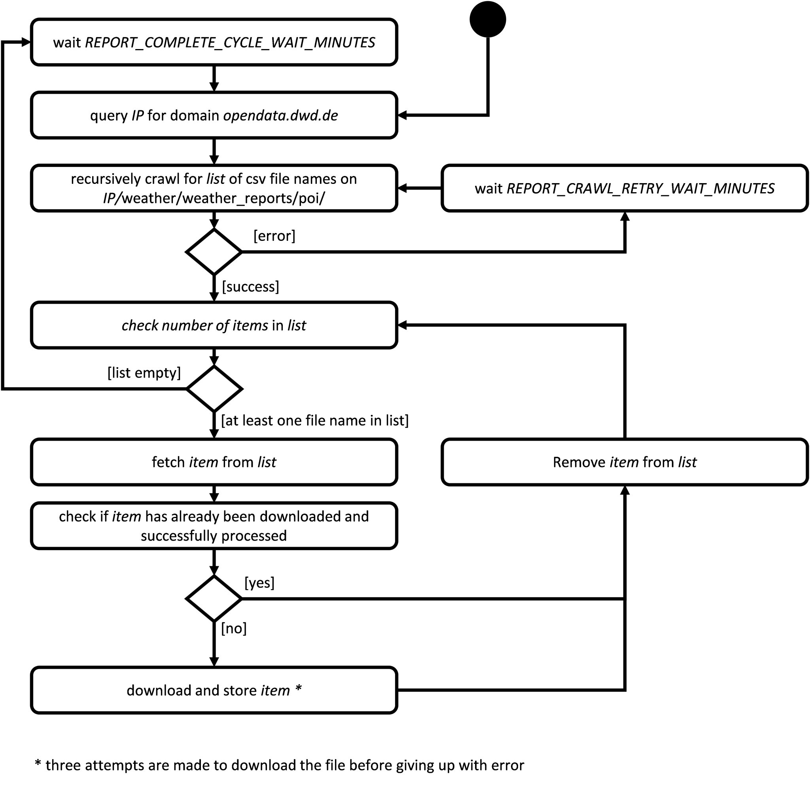
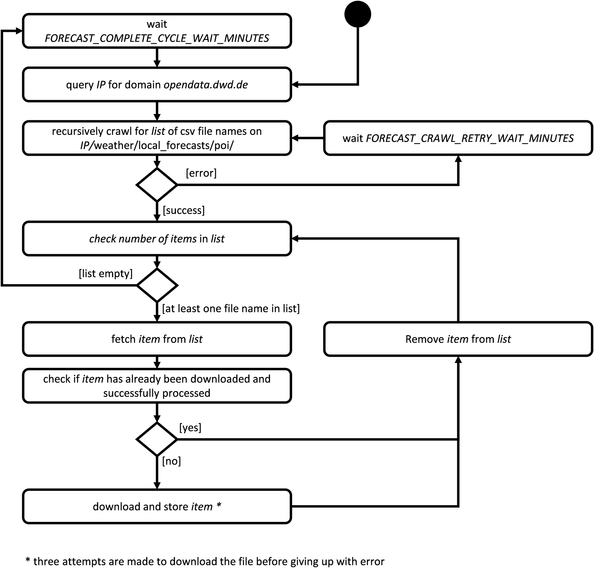
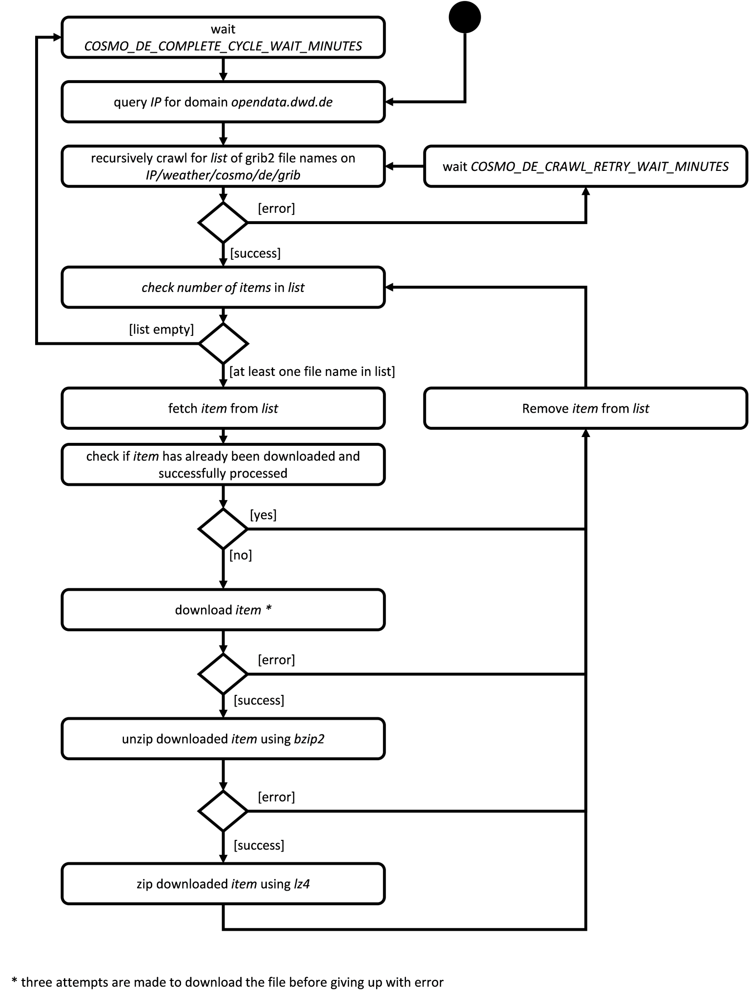

# dwd_data_crawler
dwd_data_crawler is a micro service to crawl data from DWD (Deutscher Wetter
  Dienst) and store it for later use in a file system.


## License
See the [LICENSE](./LICENSE) file for license rights and limitations (MIT).

## Dependencies
Part of data on opendata.dwd.de is provided compressed with `bzip2`. `bzip2` has
a very high compression rate but it is rather slow with decompression speed. In
order to increase performance the downloaded `bzip2` data is decompressed and
compressed with `lz4` again. `lz4` does not have a compression rate as good as
`bzip2` but is an order of magnitude faster for decompression.

As of today we, the authors of `dwd_data_crawler`, are not aware of high
performance implementation fo `bzip2` and `lz4` in plain JavaScript and/or
node.js. Therefore we have decided to perform `bzip2` and `lz4`
decompression/compression by calling LINUX `bzip2` and `lz4` commands via
`child_compress.execFile`. **Thus, `bzip2` and `lz4` commands form dependencies
of `dwd_data_crawler`.**

## Usage
dwd_data_crawler is configured by means of environment variables. Currently the
following environment variables are supported:
 * `DOWNLOAD_DIRECTORY_BASE_PATH`: Base path of the directory where the downloaded
 files shall be stored. This is a mandatory parameter.
 * `ICON_D2_CRAWL_RETRY_WAIT_MINUTES`: Number of **minutes** to wait before next attempt to
 crawl for COSMO DE data, when crawling data failed. This is an optional parameter.
 Standard value is `1`.
 * `ICON_D2_COMPLETE_CYCLE_WAIT_MINUTES`: Number of **minutes** to wait before start next
 crawl cycle for COSMO DE data, once the current cycle is finished. This is an optional parameter.
 Standard values is `10`.
 * `FORECAST_CRAWL_RETRY_WAIT_MINUTES`: Number of **minutes** to wait before next attempt to
 crawl for forecast data, when crawling data failed. This is an optional parameter.
 Standard value is `1`.
 * `FORECAST_COMPLETE_CYCLE_WAIT_MINUTES`: Number of **minutes** to wait before start next
 crawl cycle for forecast data, once the current cycle is finished. This is an optional parameter.
 Standard values is `120`.
 * `REPORT_CRAWL_RETRY_WAIT_MINUTES`: Number of **minutes** to wait before next attempt to
 crawl for report data, when crawling data failed. This is an optional parameter.
 Standard value is `1`.
 * `REPORT_COMPLETE_CYCLE_WAIT_MINUTES`: Number of **minutes** to wait before start next
 crawl cycle for report data, once the current cycle is finished. This is an optional parameter.
 Standard value is `30`.
* `LOG_LEVEL`: The [log level](https://github.com/trentm/node-bunyan#levels) to be used for this service instance. This is an optional parameter. Standard value is `info`.

Sample call to run with standard settings for optional parameters:
```
$ DOWNLOAD_DIRECTORY_BASE_PATH=/mnt/download_volume node index.js
```

## Basic idea
The basic idea behind dwd_data_crawler is to query and store data from
opendata.dwd.de. This allows for building a local data storage of historical and
forecast data for later use in research and development. opendata.dwd.de is a
free service offered by DWD which provides weather and climate data based on
real measurements and forecast calculations.

As data on opendata.dwd.de is overwritten on a regular basis, dwd_data_crawler
fetches data cyclically. As opendata.dwd.de stores data for different points in
time using the same file path, dwd_data_crawler uses a slightly different folder
structure than opendata.dwd.de.

## How it works
The dwd_data_crawler is implemented as three endless loops that run concurrently in a single node.js proces.


* reportMain cyclically queries the data from /weather/weather_reports/poi
* forecastMain cyclically queries the data from /weather/local_forecasts/poi
* ICON_D2Main cyclically queries the data from /weather/icon-d2/grib

### reportMain
Report data are queried in an endless loop as shown in the followig state chart.


At the beginning of each loop the IP address of opendata.dwd.de is queried, as due to too many requests the DNS refuses services, when all requests are made by domain name.

When the IP address is known all available paths of report files are queried as a list of items. If an error occurs while querying the list of paths of report files, a wait time of `REPORT_CRAWL_RETRY_WAIT_MINUTES` is triggered before the next attempt is made to query the list of paths of report files.

Afterwards, for each item in the list a download is performed. The download is implemented in a way, that three attempts are made to download the (this due to potential rate limiting being active at DWD). Once all items have been downloaded successully, a pause is initiated with a parameterizable wait time of `REPORT_COMPLETE_CYCLE_WAIT_MINUTES`.

As DWD reuses paths of report files the downloaded files are stored in a slightly different file structur in order to prevent new files overriding old files. For details see [file storage for reports](#dataStorageStructureReport).

### forecastMain
Forecast data are queried in an endless loop as shown in the followig state chart.


At the beginning of each loop the IP address of opendata.dwd.de is queried, as due to too many requests the DNS refuses services, when all requests are made by domain name.

When the IP address is known all available paths of forecast files are queried as a list of items. If an error occurs while querying the list of paths of forecast files, a wait time of `FORECAST_CRAWL_RETRY_WAIT_MINUTES` is triggered before the next attempt is made to query the list of paths of report files.

Afterwards, for each item in the list a download is performed. The download is implemented in a way, that three attempts are made to download the (this due to potential rate limiting being active at DWD). Once all items have been downloaded successully, a pause is initiated with a parameterizable wait time of `FORECAST_COMPLETE_CYCLE_WAIT_MINUTES`.

As DWD reuses paths of report files the downloaded files are stored in a slightly different file structur in order to prevent new files overriding old files. For details see [file storage for forecasts](#dataStorageStructureForecast).

### ICON_D2Main
Forecast data are queried in an endless loop as shown in the followig state chart.


At the beginning of each loop the IP address of opendata.dwd.de is queried, as due to too many requests the DNS refuses services, when all requests are made by domain name.

When the IP address is known all available paths of forecast files are queried as a list of items. If an error occurs while querying the list of paths of COSMO DE files, a wait time of `ICON_D2_CRAWL_RETRY_WAIT_MINUTES ` is triggered before the next attempt is made to query the list of paths of report files.

Afterwards, for each item in the list a download is performed. The download is implemented in a way, that three attempts are made to download the (this due to potential rate limiting being active at DWD). The file provided by DWD are grib2 files compressed using bzip2. While bzip2 provides a very good compression rate, decompressing bzip2 files is rather slow. Therefore the bzip2 files are decompressed and compressed again using <a href="https://en.wikipedia.org/wiki/LZ4_(compression_algorithm)">lz4 compression algorithm</a>.

Once all items have been downloaded successully, a pause is initiated with a parameterizable wait time of `ICON_D2_COMPLETE_CYCLE_WAIT_MINUTES `.

As DWD reuses paths of report files the downloaded files are stored in a slightly different file structur in order to prevent new files overriding old files. For details see [file storage for COSMO DE forecasts](#dataStorageStructureCOSMODE).

## Structure of file storage
### <a name="dataStorageStructureForecast"></a> /weather/local_forecasts/poi
#### Filepath on opendata.dwd.de
`/weather/local_forecasts/poi/$STATION_ID-MOSMIX.csv`

where
* `$STATION_ID` is the station id the forecast data refers to.

#### Filepath on local storage
`$DOWNLOAD_DIRECTORY_BASE_PATH/weather/local_forecasts/poi/$YYYY$MM$DD$HH/$STATION_ID-MOSMIX.csv`

where
* `$DOWNLOAD_DIRECTORY_BASE_PATH` is the base path for the downloaded data on the local storage
* `$YYYY` is the 4 digit year the first forecast data refers to
* `$MM` is the 2 digit month the first forecast data refers to (01 to 12)
* `$DD` is the 2 digit day of month the first forecast data refers to (01 to 31)
* `$HH` is the 2 digit hour of day the first foreact data refers to (06 or 18)
* `$STATION_ID` is the station id the forecast data refers to.

If you want to load the forecast for 9th February 2018 starting at 6 am (UTC) of station 01271 the corresponding data can be found in the file `/$DOWNLOAD_DIRECTORY_BASE_PATH/weather/local_forecasts/poi/2018020906/01271-MOSMIX.csv`

### <a name="dataStorageStructureReport"></a> /weather/weather_reports/poi
#### Filepath on opendata.dwd.de
`/weather/weather_reports/poi/$STATION_ID-BEOB.csv`

where
* `$STATION_ID` is the station id the report data refers to.

#### Filepath on local storage
`$DOWNLOAD_DIRECTORY_BASE_PATH/weather/weather_reports/poi/YYYYMMDD/STATION_ID-MOSMIX.csv`

where
* `$DOWN_LOAD_DIRECTORY_BASE_PATH` is the base path for the downloaded data on the local storage
* `$YYYY` is the 4 digit year the first report data refers to
* `$MM` is the 2 digit month the first report data refers to (01 to 12)
* `$DD` is the 2 digit day of month the first report data refers to (01 to 31)
* `$STATION_ID` is the station id the report data refers to.

If you want to load the reported data for 9th February 2018 (UTC) of station 01271 the corresponding data can be found in the file `/$DOWNLOAD_DIRECTORY_BASE_PATH/weather/local_forecasts/poi/20180209/01271-BEOB.csv`

### <a name="dataStorageStructureCOSMODE"></a> /weather/icon-d2/grib
#### ~~Filepath on opendata.dwd.de~~ <- needs update!
`/weather/cosmo/de/grib/$HH/$dwd_voi/COSMODE_single_level_elements_$DWD_VOI_$YYYY$MM$DD$HH_$FH.grib2.bz2`

where
* `$HH` is the fore cast run hour the data refers to (00, 03, 06, 09, 12, 15, 18, 21)
* `$dwd_voi` is the encoding of the value of interest in lowercase letters (e.g. alb_rad)
* `$DWD_VOI` is the encoding of the value of interest in uppercase letters (e.g. ALB_RAD)
* `$YYYY` is the 4 digit year of the forecast run the data refers to
* `$MM` is the 2 digit month of the forecast run the data refers to (01 to 12)
* `$DD` is the 2 digit day of month of the forecast run the data refers to (01 to 31)
* `$FH` is the 3 digit forecast hour of the forecast run the data refers to (e.g. 021 for forecast in 21 hours as of $YYYY-$MM-$DD $HH:00:00)

#### ~~Filepath on local storage~~ <- needs update!
`/$DOWNLOAD_DIRECTORY_BASE_PATH/icon-d2/grib/$YYYY$MM$DD$HH/$dwd_voi/COSMODE_single_level_elements_$DWD_VOI_$YYYY$MM$DD$HH_$FH.grib2.bz2`

where
* `$DOWN_LOAD_DIRECTORY_BASE_PATH` is the base path for the downloaded data on the local storage
* `$YYYY` is the 4 digit year of the forecast run the data refers to
* `$MM` is the 2 digit month of the forecast run the data refers to (01 to 12)
* `$DD` is the 2 digit day of month of the forecast run the data refers to (01 to 31)
* `$HH` is the fore cast run hour the data refers to (00, 03, 06, 09, 12, 15, 18, 21)
* `$dwd_voi` is the encoding of the value of interest in lowercase letters (e.g. alb_rad)
* `$DWD_VOI` is the encoding of the value of interest in uppercase letters (e.g. ALB_RAD)
* `$FH` is the 3 digit forecast hour of the forecast run the data refers to (e.g. 021 for forecast in 21 hours as of $YYYY-$MM-$DD $HH:00:00)
